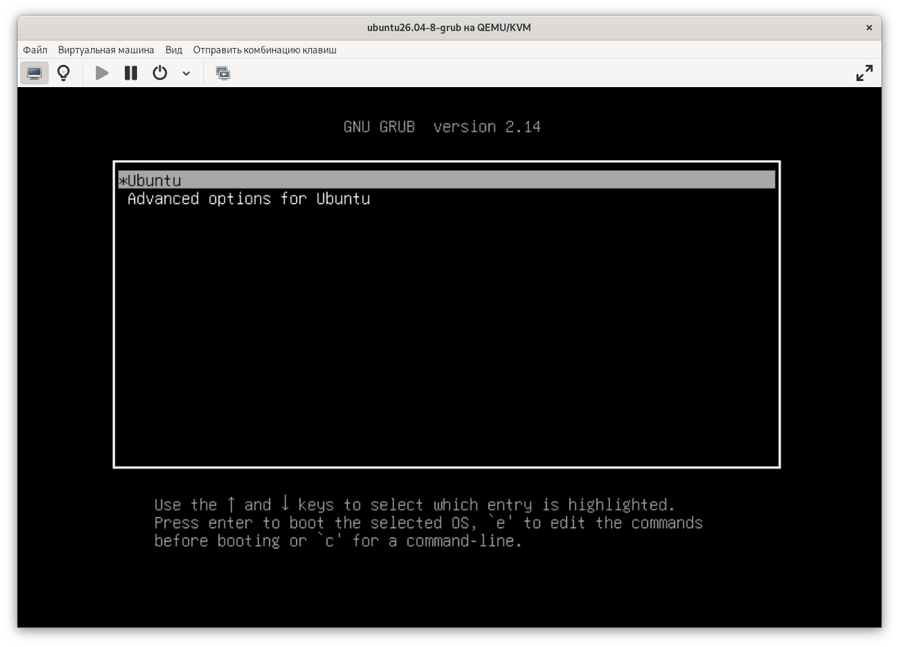
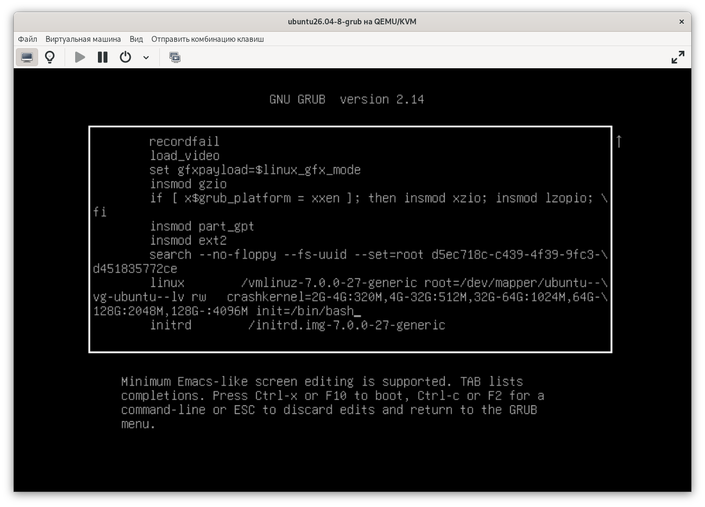
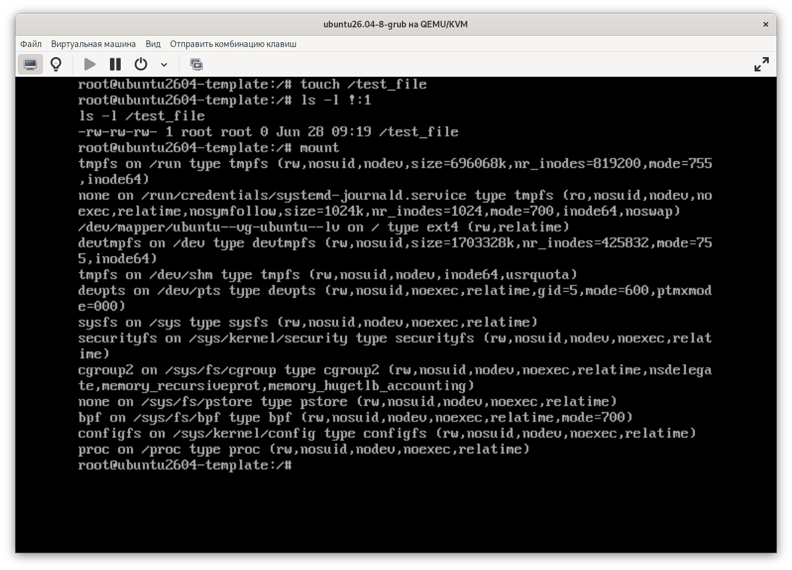
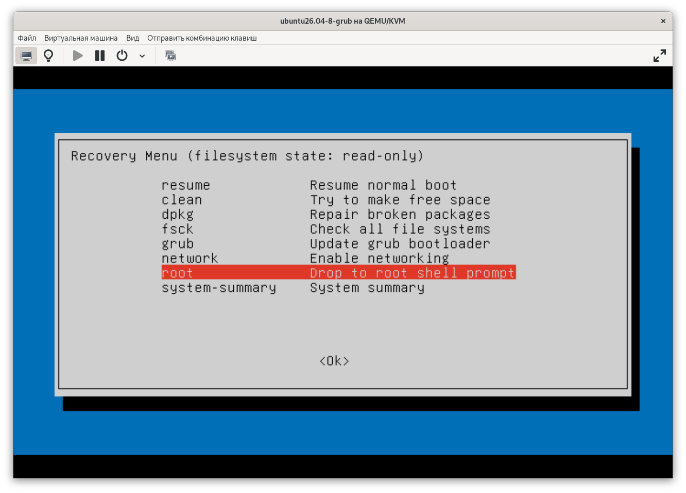
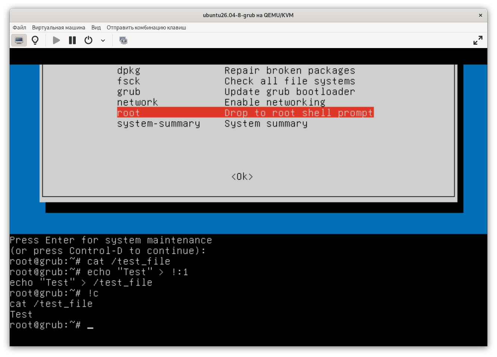

# 🎯 Задание по теме "Загрузка системы"

## Описание задания 

1. Включить отображение меню Grub.
2. Попасть в систему без пароля несколькими способами.
3. Установить систему с LVM, после чего переименовать VG.

## Решение

### 1. Включение отображения в меню Grub

Редактирование конфигурационного файла `/etc/default/grub`:

```ini
# Было
GRUB_TIMEOUT_STYLE=hidden
GRUB_TIMEOUT=0

# Стало
#GRUB_TIMEOUT_STYLE=hidden
GRUB_TIMEOUT=10
```

Применение и проверка:

```bash
root@grub:~# update-grub
Sourcing file `/etc/default/grub'
Sourcing file `/etc/default/grub.d/kdump-tools.cfg'
Generating grub configuration file ...
Found linux image: /boot/vmlinuz-7.0.0-27-generic
Found initrd image: /boot/initrd.img-7.0.0-27-generic
Found linux image: /boot/vmlinuz-7.0.0-14-generic
Found initrd image: /boot/initrd.img-7.0.0-14-generic
Warning: os-prober will not be executed to detect other bootable partitions.
Systems on them will not be added to the GRUB boot configuration.
Check GRUB_DISABLE_OS_PROBER documentation entry.
Adding boot menu entry for UEFI Firmware Settings ...
done
root@grub:~# reboot
```



### 2. Вход в систему без пароля несколькими способами

#### Способ 1. init=/bin/bash

Изменение параметров загрузки Ubuntu:



Проверка прав на запись:




#### Способ 2. Recovery mode

Выбор *root* в Recovery Menu:



Проверка прав на запись:



### 3. Переименование VG

Исходное имя Volume Group:

```bash
root@grub:~# vgs
  VG        #PV #LV #SN Attr   VSize   VFree 
  ubuntu-vg   1   1   0 wz--n- <23,00g 11,50g
```

Преименование VG `ubuntu-vg` в `ubuntu-otus`:

```bash
root@grub:~# vgrename ubuntu-vg ubuntu-otus
  Volume group "ubuntu-vg" successfully renamed to "ubuntu-otus"
```

Замена `ubuntu-vg` на `ubuntu-otus` в конфигурации grub:

```bash
root@grub:~# grep ubuntu--vg /boot/grub/grub.cfg
	linux	/vmlinuz-7.0.0-27-generic root=/dev/mapper/ubuntu--vg-ubuntu--lv ro   crashkernel=2G-4G:320M,4G-32G:512M,32G-64G:1024M,64G-128G:2048M,128G-:4096M
		linux	/vmlinuz-7.0.0-27-generic root=/dev/mapper/ubuntu--vg-ubuntu--lv ro   crashkernel=2G-4G:320M,4G-32G:512M,32G-64G:1024M,64G-128G:2048M,128G-:4096M
		linux	/vmlinuz-7.0.0-27-generic root=/dev/mapper/ubuntu--vg-ubuntu--lv ro recovery nomodeset dis_ucode_ldr 
		linux	/vmlinuz-7.0.0-14-generic root=/dev/mapper/ubuntu--vg-ubuntu--lv ro   crashkernel=2G-4G:320M,4G-32G:512M,32G-64G:1024M,64G-128G:2048M,128G-:4096M
		linux	/vmlinuz-7.0.0-14-generic root=/dev/mapper/ubuntu--vg-ubuntu--lv ro recovery nomodeset dis_ucode_ldr 

root@grub:~# sed -i 's/ubuntu--vg/ubuntu--otus/g' /boot/grub/grub.cfg

root@grub:~# grep ubuntu--vg /boot/grub/grub.cfg

root@grub:~# grep ubuntu--otus /boot/grub/grub.cfg
	linux	/vmlinuz-7.0.0-27-generic root=/dev/mapper/ubuntu--otus-ubuntu--lv ro   crashkernel=2G-4G:320M,4G-32G:512M,32G-64G:1024M,64G-128G:2048M,128G-:4096M
		linux	/vmlinuz-7.0.0-27-generic root=/dev/mapper/ubuntu--otus-ubuntu--lv ro   crashkernel=2G-4G:320M,4G-32G:512M,32G-64G:1024M,64G-128G:2048M,128G-:4096M
		linux	/vmlinuz-7.0.0-27-generic root=/dev/mapper/ubuntu--otus-ubuntu--lv ro recovery nomodeset dis_ucode_ldr 
		linux	/vmlinuz-7.0.0-14-generic root=/dev/mapper/ubuntu--otus-ubuntu--lv ro   crashkernel=2G-4G:320M,4G-32G:512M,32G-64G:1024M,64G-128G:2048M,128G-:4096M
		linux	/vmlinuz-7.0.0-14-generic root=/dev/mapper/ubuntu--otus-ubuntu--lv ro recovery nomodeset dis_ucode_ldr
```

Перестройка образов initramfs и проверка:

```bash
root@grub:~# dracut -f --regenerate-all
root@grub:~# lsinitrd | grep -i ubuntu-otus
 rd.lvm.lv=ubuntu-otus/ubuntu-lv

root@grub:~# reboot now

root@grub:~# uptime
 10:28:06 up 0 min,  1 user,  load average: 0,68, 0,16, 0,05
root@grub:~# vgs
  VG          #PV #LV #SN Attr   VSize   VFree 
  ubuntu-otus   1   1   0 wz--n- <23,00g 11,50g
```